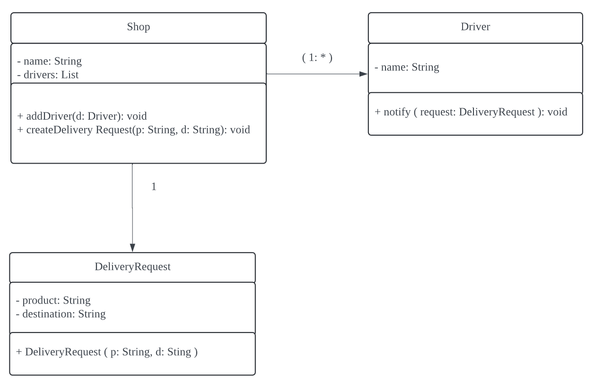
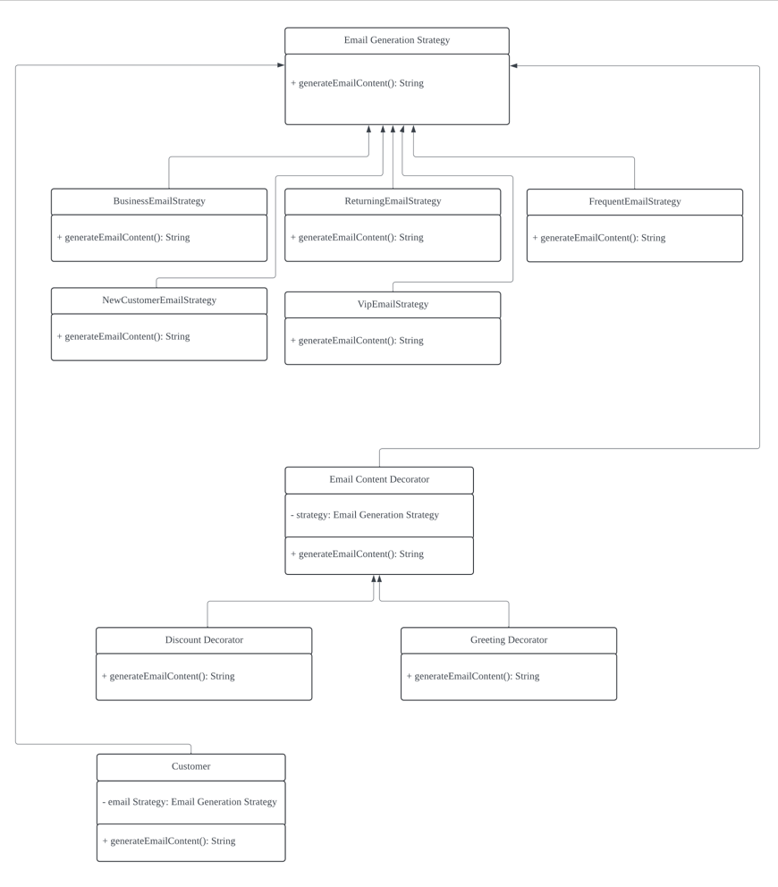

| CS-665       | Software Design & Patterns |
|--------------|----------------------------|
| Name         | Qiong Wang                 |
| Date         | 09/20/2024                 |
| Course       | Fall                       |
| Assignment # | Hw1 Automatic Beverage     |

# Assignment Overview
This project implements a fully automatic beverage vending machine that allows users to select various coffee and tea beverages, customize them by adding condiments (milk and sugar), and calculates the final price based on the selections. The project uses several software design patterns, including the Factory Method Pattern and the Decorator Pattern, to achieve flexibility and scalability.

# GitHub Repository Link:
(https://github.com/QiongWang1/CS665_Hw1)

# Implementation Description
Implementation Description
This project involves designing and implementing a fully automatic beverage vending machine using key software design principles and patterns. The machine allows users to select from a variety of beverages (e.g., coffee, tea) and customize their drink with condiments (milk and sugar).

The primary design patterns applied in this project are:
1. Factory Method Pattern:
   The BeverageFactory class is responsible for creating different types of beverages, such as coffee and tea. This pattern ensures flexibility in adding new beverage types in the future by creating a new factory method or class. If the vending machine needs to be extended to offer new beverages (e.g., hot chocolate), we can easily introduce this new type by updating or adding a new factory method without affecting the existing codebase.
2. Decorator Pattern:
   The condiment customization functionality uses the Decorator Pattern. The CondimentDecorator class allows users to add condiments like milk and sugar to their beverages. This pattern avoids the need to create subclasses for every possible combination of beverage and condiment, reducing code duplication and improving flexibility. You can add a variety of condiments (e.g., cream, honey) in the future by simply creating new decorators.
3. Strategy Pattern:
   The machine’s pricing logic is designed using the Strategy Pattern. This allows for different pricing strategies to be implemented and changed at runtime. If different pricing models are required (e.g., discounts or promotions), the strategy can be easily swapped or modified without changing the core vending machine logic.
   Flexibility:
   New beverage types or condiments can be added without changing the existing code, ensuring scalability. The factory and decorator patterns make it easy to extend functionality in the future.
   Simplicity and Code Maintenance:
   The design is modular, with separate classes handling specific responsibilities (beverage creation, condiment customization, pricing). This makes the code easy to read, understand, and maintain. Future developers can add new features without understanding the entire system.
   Code Reusability:
   By using the decorator and factory patterns, the code avoids duplication, and common functionalities (e.g., adding condiments, creating beverages) are reused across different parts of the program.

## Flexibility
The design is highly flexible, allowing for the easy addition of new beverage types (e.g., new types of tea or coffee) or new condiments (e.g., syrup or chocolate) in the future. This flexibility is achieved using the **Factory Method Pattern** for beverage creation and the **Decorator Pattern** for adding condiments. By following these patterns, new classes can be added with minimal changes to the existing codebase.

## Simplicity & Understandability
The implementation follows a clear and straightforward structure, adhering to best practices such as encapsulation and separation of concerns. Each class has a single responsibility:
- **Beverage** handles the base attributes of drinks.
- **CondimentDecorator** allows adding condiments without modifying the original beverage classes.

Code readability and maintainability are prioritized, making it easier for future developers to understand and extend.

## Avoidance of Duplicated Code
The use of inheritance and composition avoids duplicated code. For example, the common functionality for condiments (such as milk and sugar) is handled by the **CondimentDecorator** class, ensuring that any new condiment will reuse this logic. Avoiding duplicated code ensures that changes only need to be made in one place, making maintenance simpler and less error-prone.

## Design Patterns Used
1. **Factory Method Pattern**: Used to instantiate various beverages (coffee, tea).
2. **Decorator Pattern**: Allows the addition of condiments (milk, sugar) to beverages.
3. **Strategy Pattern**: A potential extension that can handle different pricing strategies based on the beverage and customization.

# UML Class Diagram
(https://lucid.app/lucidchart/1d4adc34-65e9-4a6f-851b-6aaa643021f5/edit?viewport_loc=-833%2C-361%2C3439%2C2966%2C0_0&invitationId=inv_85165761-77e7-480b-a0a7-e2ed0385c7b2)

[UML_665_Hw1.pdf](..%2F..%2F..%2FDesktop%2FBU%20courses%2F2024_fall%2FCS%20665%20-SW%20DESIGN%20%26%20PAT%2FHW%2FHw1%2FAnswer%2FUML_665_Hw1.pdf)




The following key classes are included:
- **Beverage**: Abstract class representing the basic drink.
- **Coffee** and **Tea**: Concrete implementations of Beverage.
- **CondimentDecorator**: Abstract class for adding condiments to beverages.
- **Milk** and **Sugar**: Concrete decorators for adding condiments.
- **VendingMachine**: Manages beverage creation and selection.

# Running JUnit Tests
To ensure the functionality of the beverage vending machine, several JUnit tests have been implemented. These tests verify the correct behavior of the beverage creation process, condiment addition, and pricing calculation. The tests are located in the src/test/java/edu/bu/met/cs665/hw1 directory.

Steps to Run JUnit Tests:
1. Compile the project: Before running the tests, ensure that the project is compiled.
```bash
mvn clean compile
```
2. Run all JUnit tests: To run all the JUnit tests, use the following Maven command:
```bash
mvn test
```
3. Test Report: After running the tests, Maven will generate a test report showing the success or failure of each test case. The test results will be displayed in the terminal, and you can also find detailed reports in the target/surefire-reports directory.

By following these steps, all implemented tests will be executed, confirming that the program behaves as expected.


# Maven Commands

### Prerequisites
- Java 1.8 or higher
- Apache Maven

### Compile
To compile the project, run:
```bash
mvn clean compile
